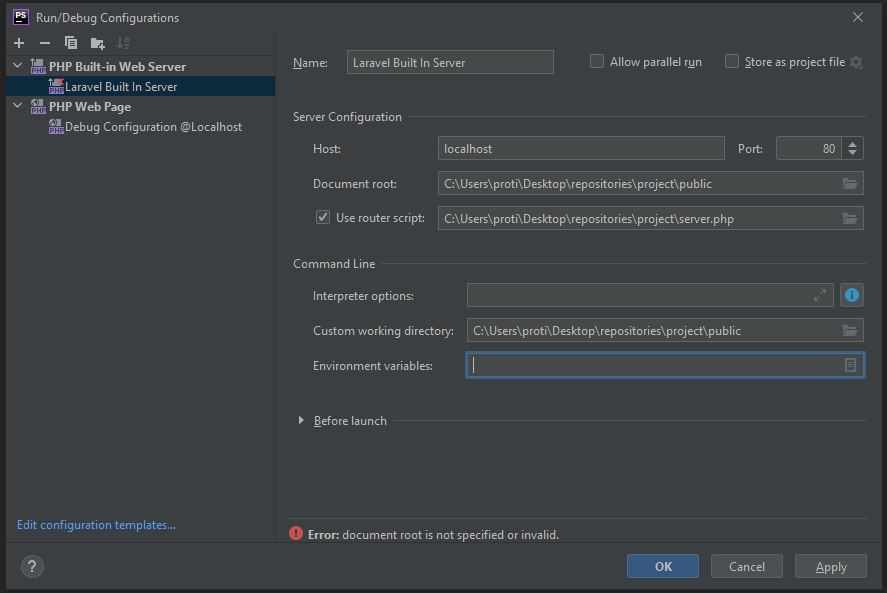
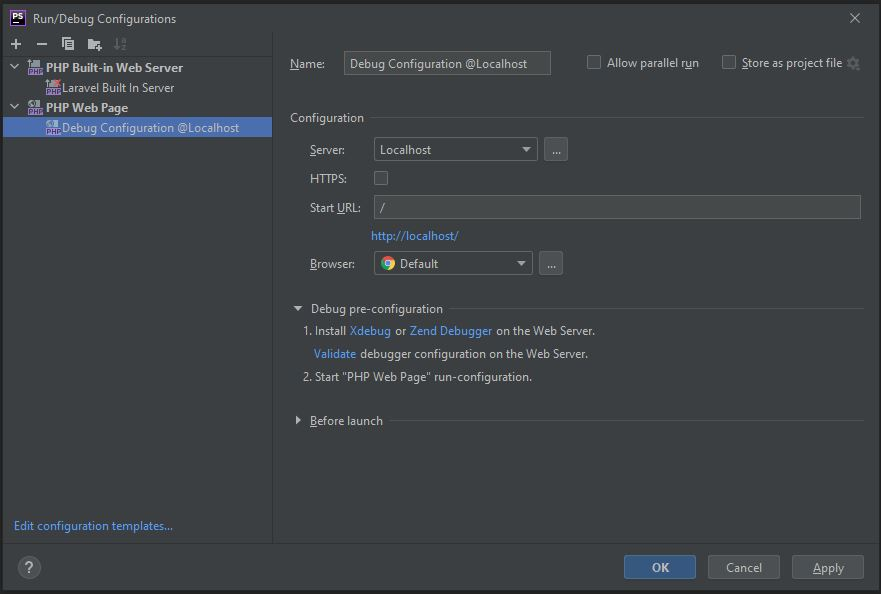
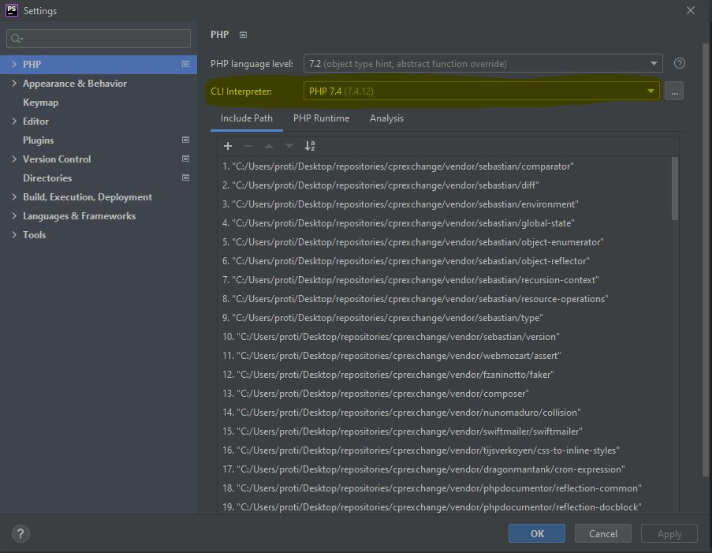
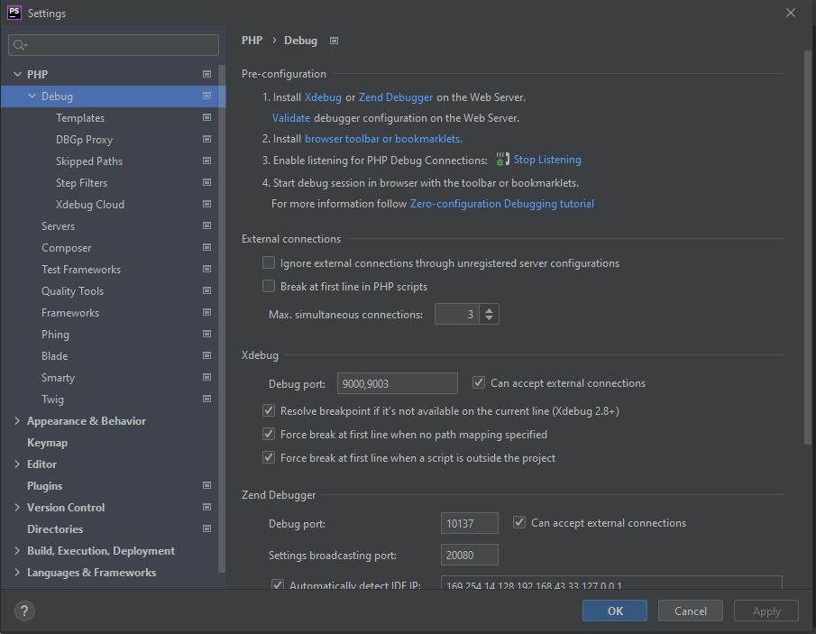
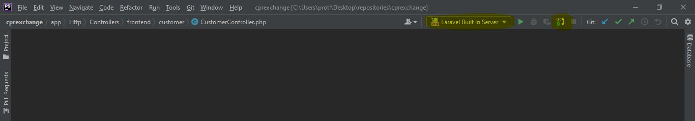
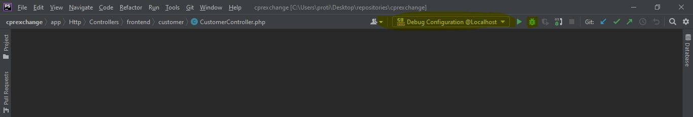
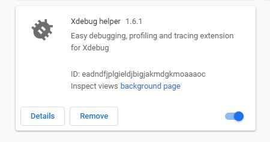

# Php Debugging: configuration using XDebug and PHPStorm

> `$ php -i `  
or  
> `echo phpinfo();`  
> and paste retrieved content into  
> https://xdebug.org/wizard  
> follow instruction  
> edit php.ini as the following, 

```configuration  
    [xdebug]  
    zend_extension = C:\xampp\php\ext\php_xdebug-3.0.1-7.4-vc15-x86_64.dll  
    xdebug.mode = debug  
    xdebug.remote_enable = 1  
    xdebug.profiler_enable = 0  
    xdebug.remote_host = "localhost"  
    xdebug.remote_port = 9000  
    xdebug.idekey = "PHPSTORM" 
    ;xdebug.profiler_append = 0  
    ;xdebug.profiler_enable_trigger = 0  
    ;xdebug.profiler_output_dir = "C:\xampp\tmp"  
    ;xdebug.profiler_output_name = "cachegrind.out.%t-%s"  
    ;xdebug.remote_handler = "dbgp"  
    ;xdebug.trace_output_dir = "C:\xampp\tmp"  
```

in newer version of xdebug , it will not work unless you add the following line,  
> `xdebug.mode = debug`  

### Configuring PHPStorm and Extensions
1. Add a run configuration  
       

2. Add a Debug configuration  
       

3. Select interpreter for your project  
       

4. Set Listener port and accept incoming debugger connection for PHPStorm    
       

5. First Run application server and turn on listener in PHPStorm    
      

6. Then Run debugging configuration in PHPStorm  
      

7. Instead of running debugging configuration you can also use xdebug helper extension in your browser    
      

8. Choose and select "debug" in extension's menu      
      
  
Application execution should halt at previously set breakpoint.  
  